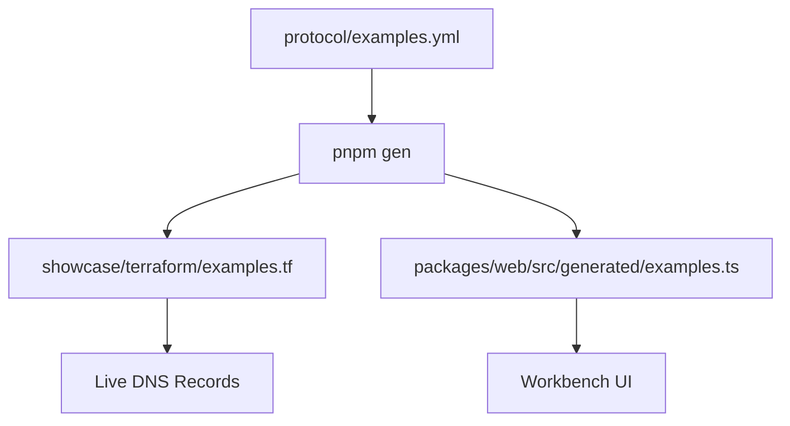

# AID Examples - Development Guide

This document explains the AID examples system: how examples are defined, generated, and used across the codebase.

## Overview

AID uses examples for:
- **Testing**: Valid AID records for parser validation and CI checks
- **Documentation**: Concrete examples in specifications and guides
- **Development**: Live DNS records for integration testing
- **UI**: Interactive examples in the workbench web interface

## Single Source of Truth

All examples are defined in `protocol/examples.yml` and generated into multiple outputs via `pnpm gen`.



## File Structure

### `protocol/examples.yml`

```yaml
examples:
  # Educational examples for learning AID format
  basic:
    simple:
      domain: "simple.agentcommunity.org"
      record: "v=aid1;u=https://api.example.com/mcp;p=mcp;a=pat;s=Basic MCP Example"
      icon: "🤖"
      description: "Simple MCP server example"
      category: "basic"

  # Real-world service examples (with PKA)
  real_world:
    firecrawl:
      domain: "firecrawl.agentcommunity.org"
      record: "v=aid1;u=https://api.firecrawl.dev;p=a2a;k=zIjKlMnOpQrStUvWxYz0123456789AbCdEfGhIjKlM;i=f1;d=https://docs.firecrawl.dev/mcp-server;s=Firecrawl A2A (Mock Service)"
      icon: "🔥"
      description: "Firecrawl web scraping service"
      category: "real_world"

  # Error cases for testing
  error_cases:
    deprecated:
      domain: "deprecated.agentcommunity.org"
      record: "v=aid1;u=https://api.deprecated.org/mcp;p=mcp;e=2025-12-31T23:59:59Z;s=Deprecated service"
      icon: "⚠️"
      description: "Deprecated service example"
      category: "error_cases"
```

### Generated Files

#### `showcase/terraform/examples.tf`
Terraform locals for DNS deployment:

```hcl
locals {
  firecrawl = {
    name  = "_agent.firecrawl"
    value = "v=aid1;u=https://api.firecrawl.dev;p=a2a;k=zIjKlMnOpQrStUvWxYz0123456789AbCdEfGhIjKlM;i=f1;d=https://docs.firecrawl.dev/mcp-server;s=Firecrawl A2A (Mock Service)"
  }

  all_examples = {
    firecrawl = local.firecrawl
    # ... other examples
  }
}
```

#### `packages/web/src/generated/examples.ts`
TypeScript constants for UI:

```typescript
export interface Example {
  title: string;
  label?: string;
  icon: ExampleIcon;
  content: string;
  domain: string;
  category: string;
}

export const BASIC_EXAMPLES: Example[] = [/* ... */];
export const REAL_WORLD_EXAMPLES: Example[] = [/* ... */];
export const OTHER_CHAT_EXAMPLES: Example[] = [/* ... */];
```

## Adding New Examples

### 1. Edit `protocol/examples.yml`

Add your example under the appropriate category:

```yaml
real_world:
  your_service:
    domain: "your-service.agentcommunity.org"
    record: "v=aid1;u=https://api.your-service.com;p=mcp;k=zYourPublicKey;i=y1;d=https://docs.your-service.com;s=Your Service Description"
    icon: "🚀"  # or "/icons/your-service.svg"
    description: "Your service description"
    category: "real_world"
```

### 2. Generate Files

```bash
pnpm gen
```

This updates:
- `showcase/terraform/examples.tf` (for DNS deployment)
- `packages/web/src/generated/examples.ts` (for UI)

### 3. Deploy DNS Records (Optional)

If you want live DNS records for your example:

```bash
cd showcase/terraform
terraform plan -var="zone=agentcommunity.org" -var="team_id=YOUR_TEAM_ID"
terraform apply -var="zone=agentcommunity.org" -var="team_id=YOUR_TEAM_ID"
```

## Example Categories

### `basic`
Educational examples demonstrating AID concepts:
- Simple records without PKA
- Format variations (messy, multi-string)
- Different protocols (MCP, local, etc.)

### `real_world`
Live service examples with full PKA authentication:
- Real domains (firecrawl.agentcommunity.org, etc.)
- Production-ready records with cryptographic keys
- Used for integration testing

### `error_cases`
Edge cases and error conditions:
- Deprecated services
- Offline/non-responsive endpoints
- Invalid record formats

## PKA Keys

All real-world examples include Public Key Authentication:

- **Format**: Multibase-encoded Ed25519 public keys (`z` prefix)
- **Key ID**: 1-6 character rotation identifier (`f1`, `s1`, `a1`, etc.)
- **Purpose**: Endpoint proof via HTTP Message Signatures (RFC 9421)

Example PKA record:
```
k=zIjKlMnOpQrStUvWxYz0123456789AbCdEfGhIjKlM;i=f1
```

## Icons

Examples support multiple icon formats:
- **Emojis**: `"🔥"`, `"🤖"`, `"⚠️"`
- **Image paths**: `"/icons/supabase.svg"`
- **React components**: Only in generated TS (converted from strings)

## Validation

### CI Checks
GitHub Actions automatically validates that generated files are up-to-date:

```yaml
- name: Check generated files are up-to-date
  run: |
    pnpm gen
    git diff --exit-code
```

### Manual Testing
Test examples work correctly:

```bash
# Test DNS resolution
pnpm -C packages/aid-doctor run check firecrawl.agentcommunity.org

# Test web UI examples
pnpm -C packages/web dev
# Visit http://localhost:3000/workbench
```

## Troubleshooting

### Generated files out of sync
```bash
# Regenerate everything
pnpm gen

# Check what changed
git diff
```

### PKA key validation
```bash
# Test PKA handshake
pnpm -C packages/aid-doctor run check --pka firecrawl.agentcommunity.org
```

### DNS deployment issues
```bash
# Check Terraform plan
cd showcase/terraform
terraform plan -var="zone=agentcommunity.org" -var="team_id=YOUR_TEAM_ID"
```

## Related Files

- `scripts/generate-examples.ts` - Generation script
- `showcase/terraform/main.tf` - DNS deployment
- `packages/web/src/lib/constants.ts` - UI imports
- `AGENTS.md` - High-level generation docs

## Contributing

When adding examples:
1. Follow the YAML structure in `protocol/examples.yml`
2. Include PKA keys for real-world examples
3. Test DNS resolution and PKA validation
4. Update this document if needed
5. Run `pnpm gen` before committing
