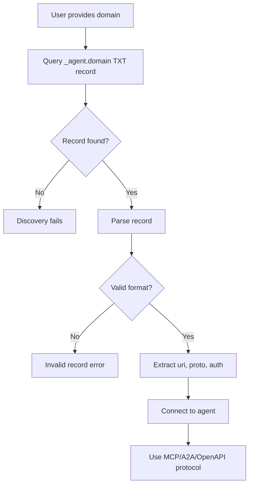

# Agent Interface Discovery (AID)

<div align="center">
  <p><strong>DNS for Agents: Type a domain. Connect to its agent. Instantly.</strong></p>
  <p>
    <a href="https://github.com/agent-community/agent-interface-discovery/actions/workflows/ci.yml">
      
    </a>
    <a href="https://aid.agentcommunity.org/workbench">
      
    </a>
    <a href="https://img.shields.io/github/package-json/v/agentcommunity/agent-interface-discovery?style=flat&label=AID%20Version&color=orange">
      
    </a>
    <a href="https://www.npmjs.com/package/@agentcommunity/aid">
      
    </a>
    <a href="https://pypi.org/project/aid-discovery/">
      
    </a>
    <a href="https://github.com/agent-community/agent-interface-discovery/blob/main/LICENSE">
      
    </a>
    <a href="https://github.com/orgs/agentcommunity/discussions">
      
    </a>
  </p>
</div>

AID is a minimal, open standard that answers one question: **"Given a domain name, where is its AI agent?"**

It uses a single DNS `TXT` record to make any agent service—whether it speaks MCP, A2A, or another protocol—instantly discoverable. No more digging through API docs, no more manual configuration.

### v1.1 Highlights

- DNS-first discovery with optional protocol-specific subdomains when requested.
- Optional `.well-known` JSON fallback (HTTPS-only, JSON content-type, ≤64KB, ~2s timeout, no redirects). On success, TTL=300.
- Optional PKA endpoint proof: Ed25519 HTTP Message Signatures with strict covered fields and ±300s time window.

[AID website](aid.agentcommunity.org)

## How It Works

AID establishes a well-known location for agent discovery. The process is simple, secure, and built on the backbone of the internet.



> Notes:
>
> - Canonical location is `_agent.<domain>`. When a specific protocol is requested, clients may query `_agent._<proto>.<domain>` then `_agent.<proto>.<domain>` before the base record.
> - `.well-known` JSON fallback is allowed only on DNS failure (HTTPS-only, JSON content-type, ≤64KB, ~2s timeout, no redirects). On success, TTL=300.
> - If `pka`/`kid` are present, clients perform an Ed25519 HTTP Message Signatures handshake with exact covered fields and ±300s windows.

## Guiding Principles

- **Decentralized & Open:** No central registry, no vendor lock-in. If you control a domain, you can publish an AID record.
- **Contract-First:** A language-agnostic [YAML file](./protocol/constants.yml) is the single source of truth for all protocol constants, ensuring cross-language consistency.
- **Protocol-Agnostic:** Discover agents speaking MCP, A2A, OpenAPI, or even local protocols running in Docker.
- **Idiomatic Libraries:** Core libraries are hand-written in each language for the best developer experience, with constants generated automatically.

## Getting Started

### Key Resources

| Resource                   | Link                                                                   | Description                                                                    |
| :------------------------- | :--------------------------------------------------------------------- | :----------------------------------------------------------------------------- |
| **Interactive Workbench**  | **[aid.agentcommunity.org](https://aid.agentcommunity.org)**           | The best way to see the protocol in action with a live resolver and generator. |
| **Official Documentation** | **[docs.agentcommunity.org/aid](https://docs.agentcommunity.org/aid)** | Read the full specification, guides, and API reference.                        |
| **Command-Line Tool**      | `npm install -g @agentcommunity/aid-doctor`                            | The quickest way to check and generate AID records from your terminal.         |

### Using the Libraries

Build AID-aware clients in your favorite language.

<details>
<summary><strong>TypeScript (Node.js & Browser)</strong></summary>

```bash
pnpm add @agentcommunity/aid
```

**Node.js (uses native DNS):**

```typescript
import { discover, AidError } from '@agentcommunity/aid';

const { record, ttl } = await discover('supabase.agentcommunity.org');
console.log(`Found ${record.proto} agent at ${record.uri} (TTL: ${ttl}s)`);
//=> Found mcp agent at https://api.supabase.com/mcp (TTL: 60s)
```

**Browser (uses DNS-over-HTTPS):**

```typescript
import { discover } from '@agentcommunity/aid/browser';

const { record } = await discover('supabase.agentcommunity.org');
console.log(`Found ${record.proto} agent at ${record.uri}`);
```

</details>

<details>
<summary><strong>Python</strong></summary>

```bash
pip install aid-discovery
```

```python
from aid_py import discover, AidError

try:
    result = discover("supabase.agentcommunity.org")
    print(f"Found {result.record.proto} agent at {result.record.uri}")
    #=> Found mcp agent at https://api.supabase.com/mcp
except AidError as e:
    print(f"AID Error ({e.code}): {e}")

# NOTE: The Python package is currently published at https://pypi.org/project/aid-discovery/ and is not yet community-owned. Community transfer is planned for a future release.
```

</details>

<details>
<summary><strong>Go</strong></summary>

```bash
go get -u github.com/agentcommunity/agent-interface-discovery/aid-go
```

```go
import (
	"fmt"
	"log"
	"github.com/agentcommunity/agent-interface-discovery/aid-go"
)

func main() {
	result, err := aid.Discover("supabase.agentcommunity.org")
	if err != nil {
		log.Fatalf("AID Error: %v", err)
	}
	fmt.Printf("Found %s agent at %s (TTL: %d)\n", result.Record.Proto, result.Record.URI, result.TTL)
    //=> Found mcp agent at https://api.supabase.com/mcp (TTL: 60)
}
```

</details>

## Monorepo Overview

This repository uses a PNPM/Turborepo monorepo structure. It contains the full suite of libraries, tools, and documentation for the AID standard.

### Packages

| Package                                                                                              | Status  | Description                                                       |
| :--------------------------------------------------------------------------------------------------- | :------ | :---------------------------------------------------------------- |
| [**@agentcommunity/aid**](https://www.npmjs.com/package/@agentcommunity/aid)                         | Public  | Core TypeScript library for Node.js and Browsers                  |
| [**@agentcommunity/aid-doctor**](https://www.npmjs.com/package/@agentcommunity/aid-doctor)           | Public  | Official CLI for checking, validating, and generating AID records |
| [**@agentcommunity/aid-conformance**](https://www.npmjs.com/package/@agentcommunity/aid-conformance) | Public  | Conformance suite exporting fixtures and a CLI runner             |
| [**aid-discovery (Python)**](https://pypi.org/project/aid-discovery/)                                | Public  | Official Python library                                           |
| [**aid-go**](https://pkg.go.dev/github.com/agentcommunity/agent-interface-discovery/aid-go)          | Public  | Official Go library                                               |
| [**aid-rs (Rust)**](./packages/aid-rs)                                                               | Public  | Parser + discovery (handshake behind feature flag)                |
| [**aid-dotnet (.NET)**](./packages/aid-dotnet)                                                       | Public  | Parser + discovery + PKA + well-known                             |
| [**aid-java (Java)**](./packages/aid-java)                                                           | Public  | Parser + discovery + PKA + well-known                             |
| [**@agentcommunity/aid-web**](./packages/web)                                                        | Private | The Next.js app for the website and workbench                     |
| **@agentcommunity/e2e-tests**                                                                        | Private | E2E tests validating our live showcase domains                    |
| **(test runners)**                                                                                   | Private | Internal packages for orchestrating Python and Go tests via Turbo |

### Project Structure

```
agent-interface-discovery/
├── protocol/                  # Protocol constants (YAML source of truth)
├── scripts/                   # Code generation and utility scripts
├── packages/
│   ├── aid/                   # Core TypeScript library (Node.js + Browser)
│   ├── aid-doctor/            # CLI tool
│   ├── aid-py/                # Python library
│   ├── aid-go/                # Go library
│   ├── aid-rs/                # Rust library (parser + discovery; handshake feature)
│   ├── aid-dotnet/            # .NET library (parser + discovery + PKA)
│   ├── aid-java/              # Java library (parser + discovery + PKA)
│   ├── web/                   # Next.js web workbench
│   ├── e2e-tests/             # End-to-end tests
│   └── (test-runners)/        # Internal test runners for Go/Python
├── tracking/                  # Development progress tracking (PHASE_*.md)
├── .github/ARCHITECTURE.md    # Comprehensive architecture documentation
├── tsconfig.base.json         # Shared TypeScript configuration
├── tsup.config.base.ts        # Shared build configuration
└── ...                        # Other configuration files
```

## Architecture

This project follows a **production-grade monorepo architecture** designed for long-term maintainability and developer productivity. Our [`ARCHITECTURE.md`](.github/ARCHITECTURE.md) provides comprehensive documentation covering:

- **Build System Decisions**: Why we chose Turbo + tsup over alternatives, with performance benchmarks
- **Cross-Platform Compatibility**: How we ensure consistent behavior across Windows, Mac, and Linux
- **Package Organization**: Clear separation of concerns between published libraries and internal tools
- **Developer Experience**: Standardized commands and hot reloading for rapid iteration

**Why This Matters**: Understanding our architectural decisions enables contributors to extend the project effectively and ensures consistent development practices as the team scales. Every choice prioritizes long-term project health over short-term convenience.

### Constants generation

- Single command: `pnpm gen` reads `protocol/constants.yml` and writes language constants.
- Currently supported: TypeScript, Python, Go, and optional Rust/.NET/Java (generated only if their package paths exist).

## Development

**Prerequisites:** Node.js (v18.17+), PNPM (v8+)

```bash
# 1. Clone the repository
git clone https://github.com/agentcommunity/agent-interface-discovery.git
cd agent-interface-discovery

# 2. Install dependencies
pnpm install
```

### Core Monorepo Scripts

Thanks to Turborepo's intelligent caching, commands only rebuild what changed.

| Command         | Description                                                      |
| :-------------- | :--------------------------------------------------------------- |
| `pnpm dev`      | Start all packages in development/watch mode.                    |
| `pnpm dev:core` | Start only core libraries (aid + aid-doctor) for focused work.   |
| `pnpm dev:web`  | Start web interface and its dependencies.                        |
| `pnpm build`    | Build all packages for production (with intelligent caching).    |
| `pnpm test`     | Run the entire test suite across all languages (TS, Python, Go). |
| `pnpm lint`     | Lint and format all code.                                        |
| `pnpm e2e`      | Run end-to-end tests against the live showcase records.          |
| `pnpm gen`      | Regenerate constant files from the YAML contract.                |
| `pnpm clean`    | Remove all build artifacts (`dist`, `.turbo`, etc.).             |

### The Contract-First Workflow

The single source of truth for all protocol constants is `protocol/constants.yml`. To update them across all language packages, follow this process:

1.  **Edit the YAML file:** Make your changes in `protocol/constants.yml`.
2.  **Run the generator:** This command reads the YAML and updates the corresponding files in the TS, Go, and Python packages.
    ```bash
    pnpm gen
    ```
3.  **Verify and commit:** Run the full test suite and build to ensure everything works.
    ```bash
    pnpm clean && pnpm build && pnpm test
    ```
    Commit the changes to `protocol/constants.yml` along with all the newly generated files. The CI pipeline will fail if they are not in sync.

### Release v1.1 Checklist

- Changesets
  - Create/update a changeset bumping `@agentcommunity/aid`, `@agentcommunity/aid-doctor`, and `@agentcommunity/aid-conformance` to `1.1.0` (minor).
  - Merge to main and let CI version/publish to npm.
- Python
  - Ensure `packages/aid-py/pyproject.toml` version is `1.1.0` (done here).
  - `pip build` and `twine upload` to PyPI (aid-discovery).
- Go
  - Tag repository `aid-go` path with `v1.1.0` (semantic import version tag).
- Rust (optional)
  - If publishing, set `packages/aid-rs/Cargo.toml` to `1.1.0` and `cargo publish` (handshake feature gated).
- .NET / Java (optional)
  - If packaging, set `<Version>1.1.0</Version>` in `AidDiscovery.csproj`, and set `version = '1.1.0'` in Gradle `build.gradle`, then publish to NuGet/Maven as desired.
- Docs
  - Deploy docs site with updated Quickstarts and Discovery API reference.

### Development Environment

- **Node.js**: Version 18.17+ required (enforced via `engines` field and `.nvmrc`)
- **PNPM**: Version 8+ required for workspace support
- **Cross-Platform**: All scripts work identically on Windows, Mac, and Linux
- **Hot Reloading**: All packages support watch mode for rapid development
- **Intelligent Caching**: Turbo only rebuilds packages that actually changed, dramatically speeding up development cycles

### Build Performance

Thanks to our production-grade setup:

- **First build**: ~15 seconds for all packages
- **Incremental builds**: ~1-3 seconds for most changes
- **Test runs**: Only affected packages run tests
- **Cross-platform**: Identical behavior on all operating systems

## Community & Support

- For questions, ideas, and support, join our **[GitHub Discussions](https://github.com/orgs/agentcommunity/discussions)**.
- Chat with us on **[Discord](https://discord.gg/S5XqVHrj)**.
- To contribute, please see our **[Contributing Guide](./CONTRIBUTING.md)** and **[Code of Conduct](./CODE_OF_CONDUCT.md)**.

## License

This project is licensed under the MIT License - see the [LICENSE](./LICENSE) file for details.
