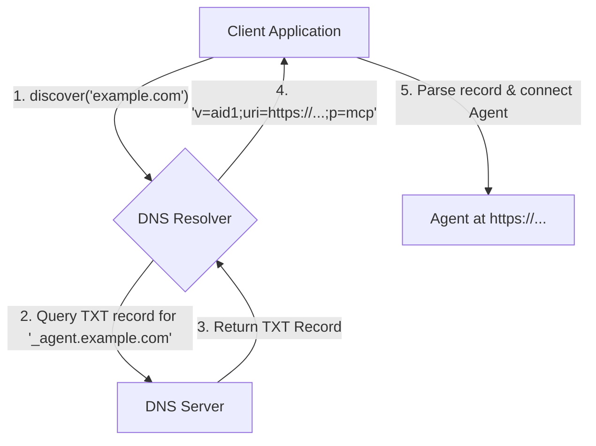

# Agent Interface Discovery (AID)

<div align="center">
  <p><strong>DNS for Agents: Type a domain. Connect to its agent. Instantly.</strong></p>
  <p>
    <a href="https://github.com/agent-community/agent-interface-discovery/actions/workflows/ci.yml">
      
    </a>
    <a href="https://www.npmjs.com/package/@agentcommunity/aid">
      
    </a>
    <a href="https://pypi.org/project/aid-discovery/">
      
    </a>
    <a href="https://github.com/agent-community/agent-interface-discovery/blob/main/LICENSE">
      
    </a>
    <a href="https://github.com/orgs/agentcommunity/discussions">
      
    </a>
  </p>
</div>

AID is a minimal, open standard that answers one question: **"Given a domain name, where is its AI agent?"**

It uses a single DNS `TXT` record to make any agent service—whether it speaks MCP, A2A, or another protocol—instantly discoverable. No more digging through API docs, no more manual configuration.

## How It Works

AID establishes a well-known location for agent discovery. The process is simple, secure, and built on the backbone of the internet.



## Guiding Principles

- **Decentralized & Open:** No central registry, no vendor lock-in. If you control a domain, you can publish an AID record.
- **Contract-First:** A language-agnostic [YAML file](./protocol/constants.yml) is the single source of truth for all protocol constants, ensuring cross-language consistency.
- **Protocol-Agnostic:** Discover agents speaking MCP, A2A, OpenAPI, or even local protocols running in Docker.
- **Idiomatic Libraries:** Core libraries are hand-written in each language for the best developer experience, with constants generated automatically.

## Getting Started

### Key Resources

| Resource                   | Link                                                                   | Description                                                                    |
| :------------------------- | :--------------------------------------------------------------------- | :----------------------------------------------------------------------------- |
| **Interactive Workbench**  | **[aid.agentcommunity.org](https://aid.agentcommunity.org)**           | The best way to see the protocol in action with a live resolver and generator. |
| **Official Documentation** | **[docs.agentcommunity.org/aid](https://docs.agentcommunity.org/aid)** | Read the full specification, guides, and API reference.                        |
| **Command-Line Tool**      | `npm install -g @agentcommunity/aid-doctor`                            | The quickest way to check any domain's AID record from your terminal.          |

### Using the Libraries

Build AID-aware clients in your favorite language.

<details>
<summary><strong>TypeScript (Node.js & Browser)</strong></summary>

```bash
pnpm add @agentcommunity/aid
```

**Node.js (uses native DNS):**

```typescript
import { discover, AidError } from '@agentcommunity/aid';

const { record, ttl } = await discover('supabase.agentcommunity.org');
console.log(`Found ${record.proto} agent at ${record.uri} (TTL: ${ttl}s)`);
//=> Found mcp agent at https://api.supabase.com/mcp (TTL: 60s)
```

**Browser (uses DNS-over-HTTPS):**

```typescript
import { discover } from '@agentcommunity/aid/browser';

const { record } = await discover('supabase.agentcommunity.org');
console.log(`Found ${record.proto} agent at ${record.uri}`);
```

</details>

<details>
<summary><strong>Python</strong></summary>

```bash
pip install aid-discovery
```

```python
from aid_py import discover, AidError

try:
    result = discover("supabase.agentcommunity.org")
    print(f"Found {result.record.proto} agent at {result.record.uri}")
    #=> Found mcp agent at https://api.supabase.com/mcp
except AidError as e:
    print(f"AID Error ({e.code}): {e}")
```

</details>

<details>
<summary><strong>Go</strong></summary>

```bash
go get -u github.com/agentcommunity/agent-interface-discovery/aid-go
```

```go
import (
	"fmt"
	"log"
	"github.com/agentcommunity/agent-interface-discovery/aid-go"
)

func main() {
	result, err := aid.Discover("supabase.agentcommunity.org")
	if err != nil {
		log.Fatalf("AID Error: %v", err)
	}
	fmt.Printf("Found %s agent at %s (TTL: %d)\n", result.Record.Proto, result.Record.URI, result.TTL)
    //=> Found mcp agent at https://api.supabase.com/mcp (TTL: 60)
}
```

</details>

## Monorepo Overview

This repository uses a PNPM/Turborepo monorepo structure. It contains the full suite of libraries, tools, and documentation for the AID standard.

### Packages

| Package                                                                                                  | Status  | Description                                                       |
| :------------------------------------------------------------------------------------------------------- | :------ | :---------------------------------------------------------------- |
| [**@agentcommunity/aid**](https://www.npmjs.com/package/@agentcommunity/aid)                             | Public  | Core TypeScript library for Node.js and Browsers                  |
| [**@agentcommunity/aid-doctor**](https://www.npmjs.com/package/@agentcommunity/aid-doctor)               | Public  | Official CLI for checking and validating AID records              |
| [**aid-discovery (Python)**](https://pypi.org/project/aid-discovery/)                                    | Public  | Official Python library                                           |
| [**aid-go**](https://pkg.go.dev/github.com/agentcommunity/agent-interface-discovery/aid-go)              | Public  | Official Go library                                               |
| [**@agentcommunity/aid-web-generator**](https://www.npmjs.com/package/@agentcommunity/aid-web-generator) | Public  | Reusable JS library for building and validating AID TXT records   |
| [**@agentcommunity/aid-web**](./packages/web)                                                            | Public  | The Next.js app for the website and workbench                     |
| **@agentcommunity/e2e-tests**                                                                            | Private | E2E tests validating our live showcase domains                    |
| **(test runners)**                                                                                       | Private | Internal packages for orchestrating Python and Go tests via Turbo |

### Project Structure

```
agent-interface-discovery/
├── protocol/                  # Protocol constants (YAML source of truth)
├── scripts/                   # Code generation and utility scripts
├── packages/
│   ├── aid/                   # Core TypeScript library (Node.js + Browser)
│   ├── aid-doctor/            # CLI tool
│   ├── aid-py/                # Python library
│   ├── aid-go/                # Go library
│   ├── aid-web/               # Next.js web workbench
│   ├── aid-web-generator/     # Shared record generation/validation logic
│   ├── e2e-tests/             # End-to-end tests
│   └── (test-runners)/        # Internal test runners for Go/Python
├── docs/
│   ├── development/           # Progress journal (PHASE_*.md), TODOs, dev notes
│   └── ...                    # Specification and other documentation
└── ...
```

## Development

**Prerequisites:** Node.js (v18+), PNPM (v9+)

```bash
# 1. Clone the repository
git clone https://github.com/agentcommunity/agent-interface-discovery.git
cd agent-interface-discovery

# 2. Install dependencies
pnpm install
```

### Core Monorepo Scripts

Thanks to Turborepo, you can run all commands from the root directory.

| Command      | Description                                                      |
| :----------- | :--------------------------------------------------------------- |
| `pnpm dev`   | Start all packages in development/watch mode.                    |
| `pnpm build` | Build all packages for production.                               |
| `pnpm test`  | Run the entire test suite across all languages (TS, Python, Go). |
| `pnpm lint`  | Lint and format all code.                                        |
| `pnpm e2e`   | Run end-to-end tests against the live showcase records.          |
| `pnpm gen`   | Regenerate constant files from the YAML contract.                |
| `pnpm clean` | Remove all build artifacts (`dist`, `.turbo`, etc.).             |

### The Contract-First Workflow

The single source of truth for all protocol constants is `protocol/constants.yml`. To update them across all language packages, follow this process:

1.  **Edit the YAML file:** Make your changes in `protocol/constants.yml`.
2.  **Run the generator:** This command reads the YAML and updates the corresponding files in the TS, Go, and Python packages.
    ```bash
    pnpm gen
    ```
3.  **Verify and commit:** Run the full test suite (`pnpm test`) and commit the changes to `protocol/constants.yml` along with all the newly generated files. The CI pipeline will fail if they are not in sync.

## Community & Support

- For questions, ideas, and support, join our **[GitHub Discussions](https://github.com/orgs/agentcommunity/discussions)**.
- Chat with us on **[Discord](https://discord.gg/S5XqVHrj)**.
- To contribute, please see our **[Contributing Guide](./CONTRIBUTING.md)** and **[Code of Conduct](./CODE_OF_CONDUCT.md)**.

## License

This project is licensed under the MIT License - see the [LICENSE](./LICENSE) file for details.
