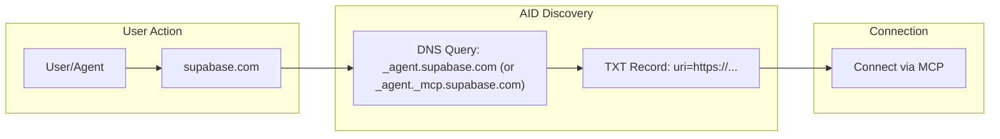

[View raw markdown](https://github.com/agentcommunity/agent-interface-discovery/raw/main/packages/docs/index.md)

# Agent Interface Discovery (AID)

> ## DNS for Agents
>
> _Type a domain. Connect to its agent. Instantly._

AID is a minimal, open standard that answers one question: **“Given a domain name, where is its AI agent?”**

It uses a single DNS `TXT` record to make any agent service—whether it speaks MCP, A2A, or another protocol—instantly discoverable. No more digging through docs, no more manual configuration.

[**:rocket: Try it now — Live Resolver & Generator**](https://aid.agentcommunity.org/workbench){ .md-button .md-button--primary target="\_blank" }

---

!!! agent "The 'It Just Works' Moment"
A developer wants to use Supabase's tools. They type `supabase.com` into their client. The client queries DNS, finds the official MCP endpoint, and connects. **Zero extra steps.**

## How It Works (The 15-Second Version)

1.  **Provider Publishes a Record:** A service provider (e.g., Google) adds a single `TXT` record to their DNS at the canonical location: `_agent.<domain>`. (For advanced use, protocol-specific subdomains like `_agent._mcp.<domain>` are also supported—see below.)
2.  **Client Queries DNS:** A client application takes the user's input (`google.com`) and queries the `TXT` record at `_agent.google.com`. If looking for a specific protocol, it MAY first try `_agent._mcp.google.com` and fall back to `_agent.google.com` if not found.
3.  **Client Connects:** The `TXT` record contains the `uri` of the agent endpoint. The client uses this to connect directly.

> **Note:**
>
> - The canonical, required location is `_agent.<domain>`. Protocol-specific subdomains (e.g., `_agent._mcp.<domain>`) are optional and only needed if a provider wants to expose multiple agent protocols for the same domain.

That's it. The heavy lifting (authentication, capability negotiation) is handled by the agent protocol itself (like MCP). AID just gets you to the right front door.

## Why You Should Care

- **For Providers:** Make your agent instantly discoverable. It's one DNS record.
- **For Client Devs:** Write one discovery function, not ten. Support any AID-compliant agent out of the box.
- **For the Ecosystem:** A simple, open, and decentralized standard is the foundation for a truly interoperable agent web. No central registry, no lock-in.

## Links

- [:material-file-document-outline:{ .lg .middle } **Specification**](specification.md)

  Read the full v1.0.0 Specification. Lean, mean, and ready to implement.

- [:material-forum:{ .lg .middle } **Design Rationale**](rationale.md)

  Understand the "why" behind the new, simplified design.

- [:material-source-branch:{ .lg .middle } **_agent registry (soon) **]

  See the official list of `proto` and `auth` tokens.

- [:material-rocket-launch:{ .lg .middle } **Set up \_agent record**](generator.md)

  Use our simple tools to validate or generate your AID record.

---

### Want the deep dive?

- [**Rationale**](rationale.md) – _Why we chose DNS, why the manifest was removed, and why simplicity wins._
- [**Specification**](specification.md) – _The exact `TXT` record format, client algorithm, and security rules._
